# DecoupledMarket

<p align="center">
  <a href="papers/decoupledmarket.pdf"></a>
  
  
  
</p>

<p align="center">
  <b>Evolving Quantitative Reasoning through Self-Play in Digital Twin Markets</b>
</p>

<p align="center">
  Tianmi Ma, Wenxin Huang, Jiawei Du, Lin Li, Xian Zhong, Joey Tianyi Zhou
</p>

<p align="center">
  <a href="papers/decoupledmarket.pdf">Paper</a> |
  <a href="#quick-start">Quick Start</a> |
  <a href="#repository-structure">Code</a> |
  <a href="#citation">Citation</a>
</p>

<p align="center">
  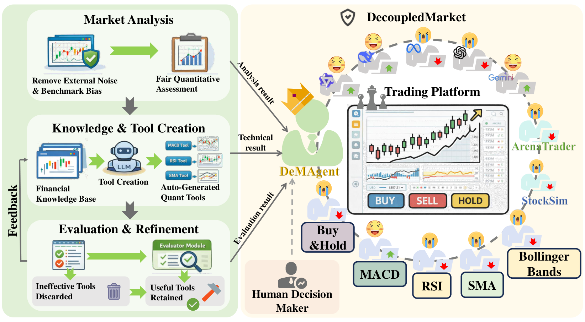
</p>

## Overview

DecoupledMarket is a controllable digital twin market for studying LLM-driven quantitative reasoning. The key idea is to decouple high-level reasoning from numerical computation: LLM agents plan, analyze, and interpret results, while specialized tools handle quantitative computation and statistical inference.

The framework supports self-play among heterogeneous trading agents, performance-based feedback, tool construction, technical analysis, and reproducible market simulation.

## Relationship to Agent Trading Arena

This code is designed to live under the main [Agent-Trading-Arena](https://github.com/MTMQuantAI/Agent-Trading-Arena) repository as:

```text
Agent-Trading-Arena/
|-- Agent-Trading-Arena/   # EMNLP Findings 2025 code
|-- decoupledmarket/       # DecoupledMarket code
|-- docs/
|-- images/
`-- README.md
```

The original Agent Trading Arena code should remain available for the Findings of EMNLP 2025 paper. DecoupledMarket extends the same research line toward self-play, tool construction, and decoupled quantitative reasoning in digital twin markets.

## Highlights

- Digital twin market for reproducible agent trading experiments.
- Decoupled reasoning-computation workflow for quantitative finance.
- Heterogeneous agents, including LLM agents, technical traders, virtual agents, and baseline strategies.
- Tool-augmented planning, evaluation, and refinement loop.
- Parallel simulation runner and performance monitoring utilities.

## Motivation

<p align="center">
  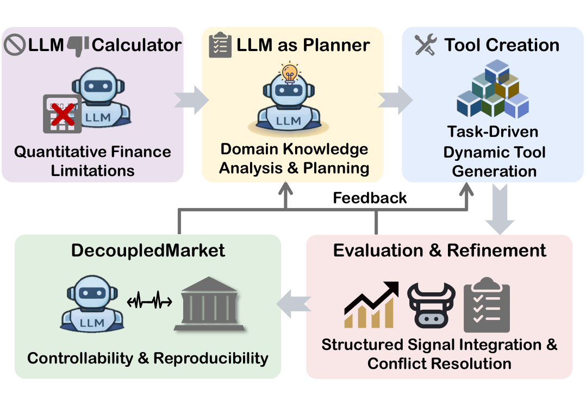
</p>

Large language models are useful planners, but they are not reliable calculators for quantitative finance. DecoupledMarket assigns LLMs to planning and interpretation while delegating numerical computation to explicit tools, then evaluates and refines behavior inside a controlled market environment.

## Method

<p align="center">
  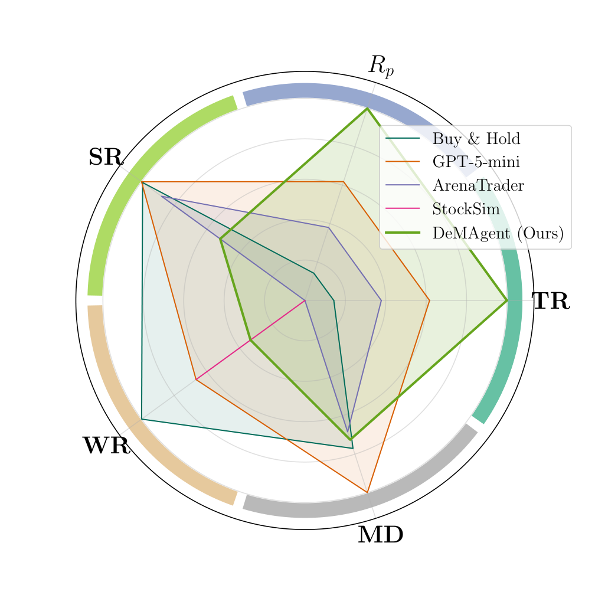
  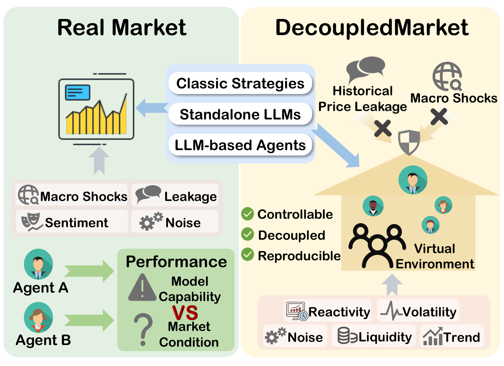
</p>

The platform provides controllability and reproducibility for market reasoning tasks. Agents repeatedly interact with the market, receive structured feedback, refine tools and strategies, and compete against baselines.

## Results

### Cross-Market Evaluation

<p align="center">
  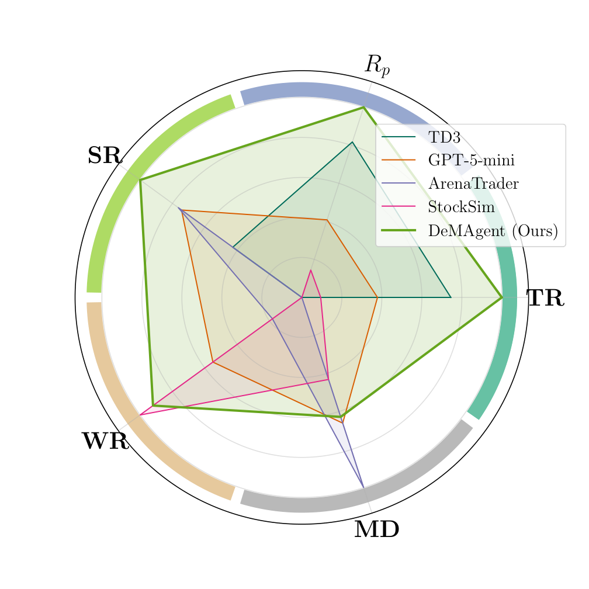
  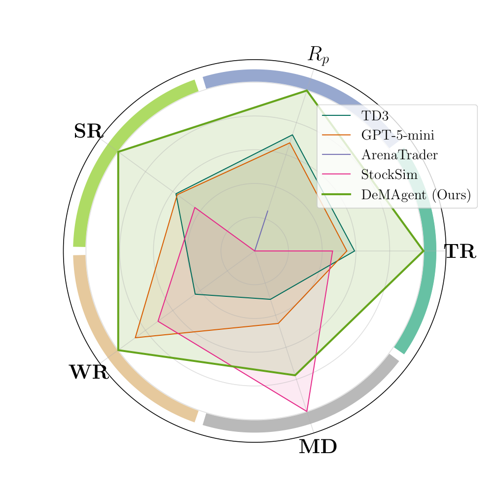
  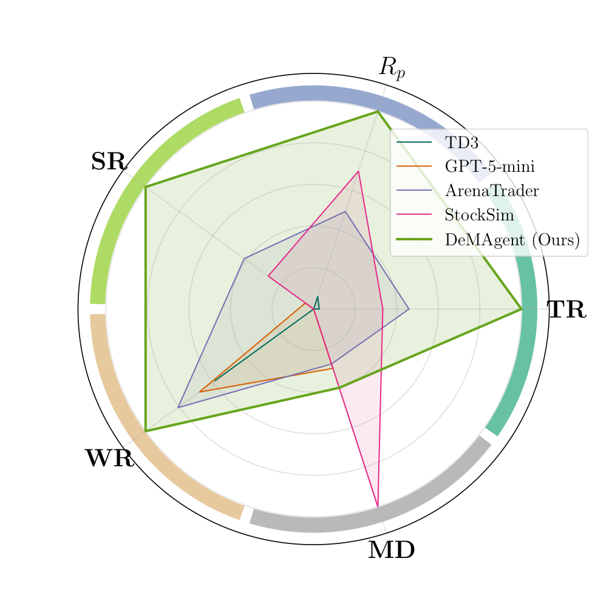
</p>

### Wealth Dynamics

<p align="center">
  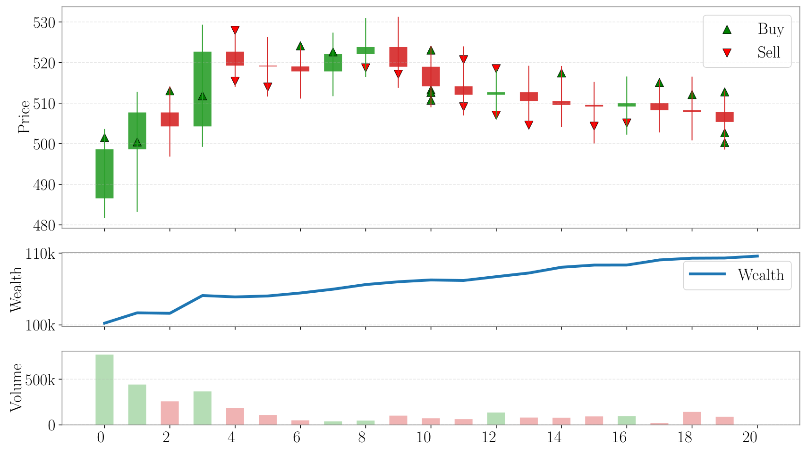
  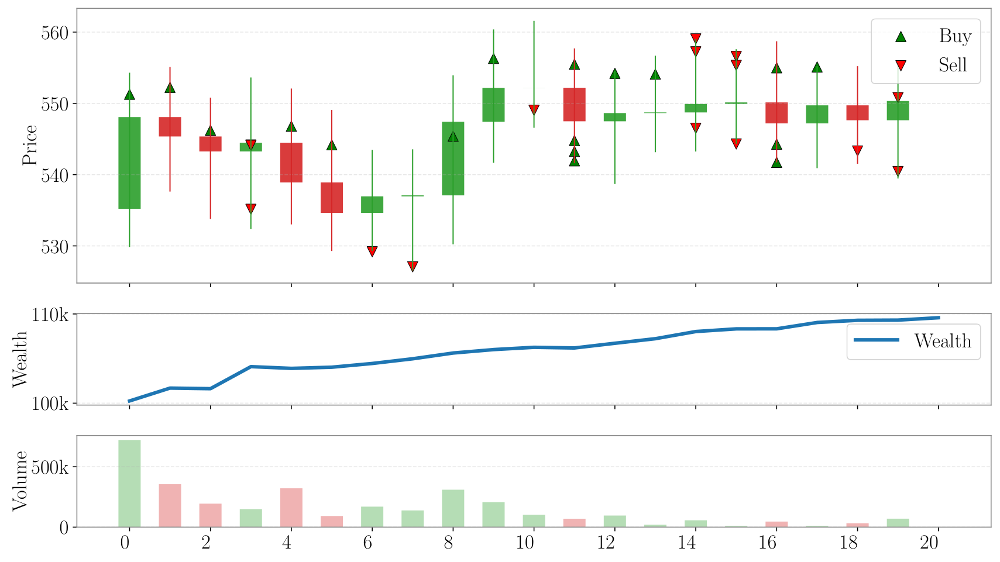
  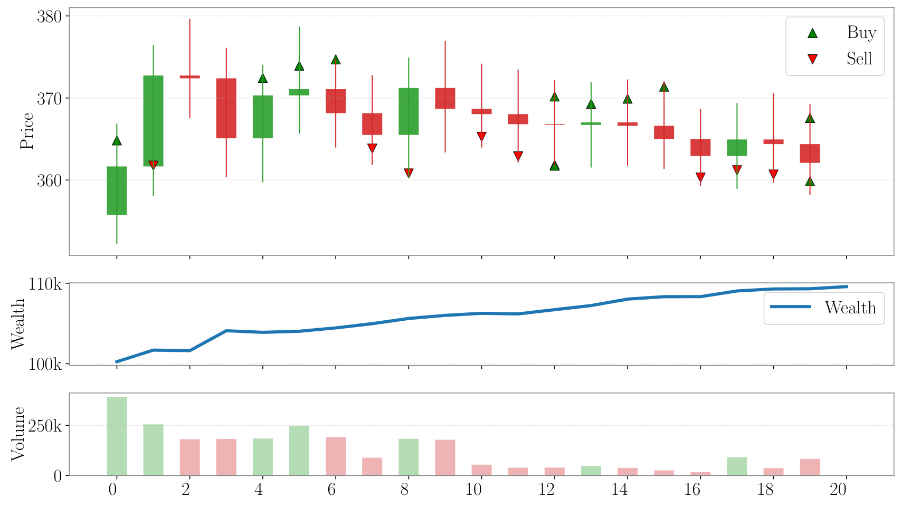
</p>

### Case Study

<p align="center">
  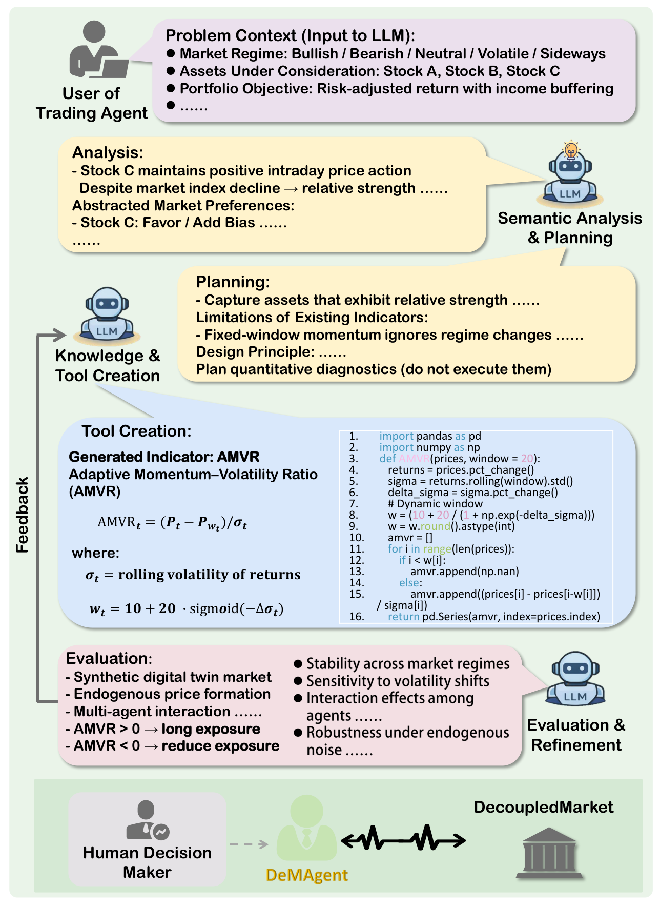
</p>

## Installation

```bash
git clone https://github.com/MTMQuantAI/Agent-Trading-Arena.git
cd Agent-Trading-Arena/decoupledmarket
pip install -e .
```

You can also install dependencies directly:

```bash
pip install -r requirements.txt
```

API keys are read from environment variables. No API key is hard-coded in the Python source files.

```bash
export OPENAI_API_KEY="..."
export GLM_API_KEY="..."
export DEEPINFRA_API_KEY="..."
export DEEPSEEK_API_KEY="..."
export GOOGLE_API_KEY="..."
```

## Quick Start

Run the original sequential simulator:

```bash
python scripts/run.py
```

Run the parallel simulator:

```bash
python scripts/run_parallel.py --mode parallel --executor thread
```

Run a quick performance comparison:

```bash
python scripts/performance_test.py --quick
```

Run as a package module after installation:

```bash
python -m decoupledmarket.main_parallel --mode parallel --executor thread
```

## Repository Structure

```text
decoupledmarket/
|-- assets/              # README figures
|-- docs/                # Notes, reports, and project documentation
|-- papers/              # Paper PDF
|-- scripts/             # Entrypoints and experiment runners
|-- src/decoupledmarket/ # Importable simulation package
|-- tests/               # Smoke tests
|-- pyproject.toml
`-- requirements.txt
```

Core modules:

- `src/decoupledmarket/main.py`: sequential simulation entry point.
- `src/decoupledmarket/main_parallel.py`: parallel simulation entry point.
- `src/decoupledmarket/Market.py`, `Stock.py`, `Person.py`: market, stock, and trader primitives.
- `src/decoupledmarket/Arena.py`, `virtual_agent.py`: LLM and virtual agent implementations.
- `src/decoupledmarket/content/`: prompt templates and LLM helper functions.
- `src/decoupledmarket/arena_content/`: technical trader and arena prompt logic.

## Paper

The local paper PDF is available at [papers/decoupledmarket.pdf](papers/decoupledmarket.pdf).

## Citation

```bibtex
@inproceedings{ma2026decoupledmarket,
  title     = {Evolving Quantitative Reasoning through Self-Play in Digital Twin Markets},
  author    = {Ma, Tianmi and Huang, Wenxin and Du, Jiawei and Li, Lin and Zhong, Xian and Zhou, Joey Tianyi},
  booktitle = {Proceedings of the 43rd International Conference on Machine Learning},
  year      = {2026}
}
```

## Acknowledgements

This project builds on the Agent Trading Arena line of work and extends it toward decoupled quantitative reasoning in digital twin markets.
